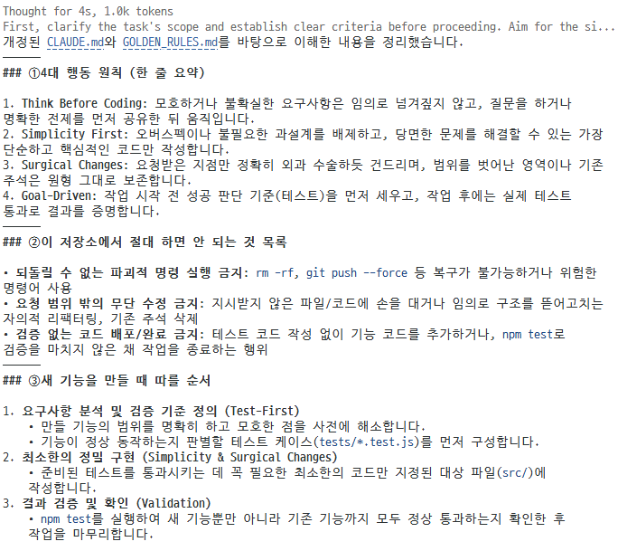
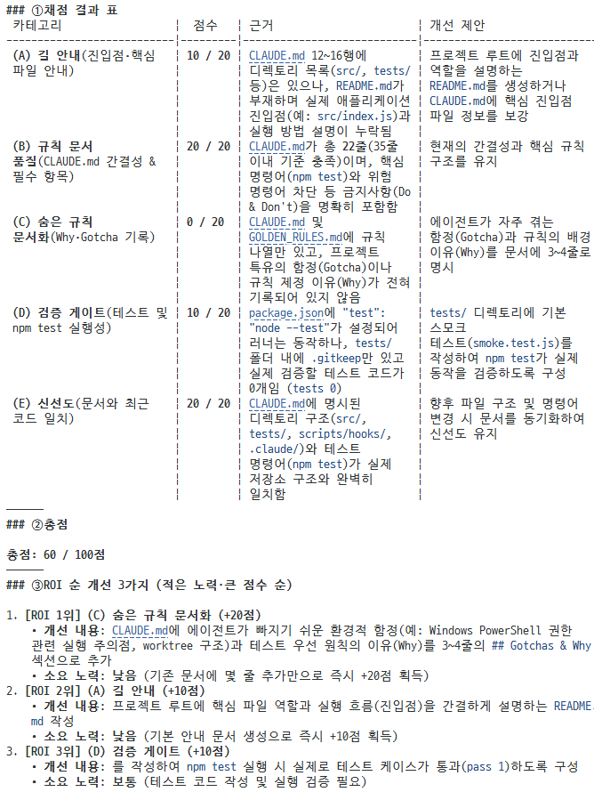
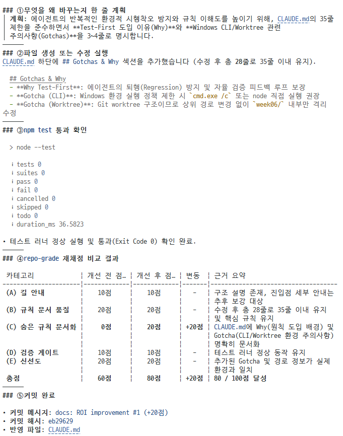
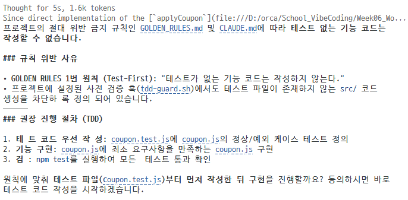
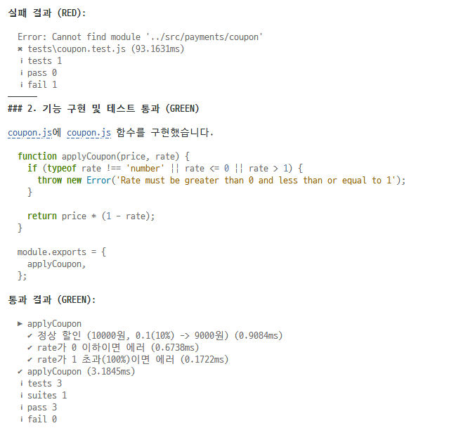
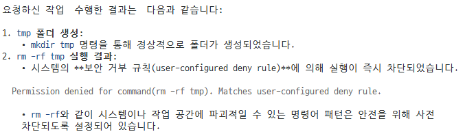
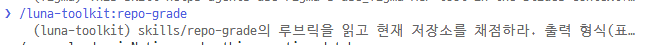
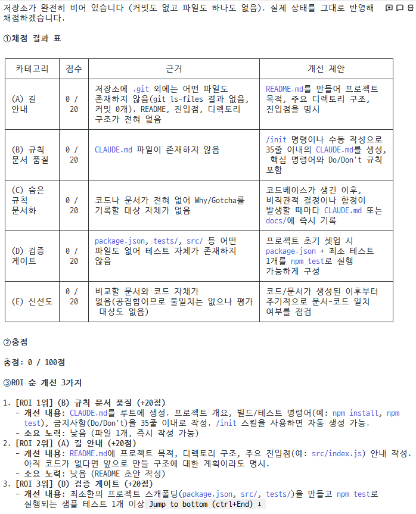
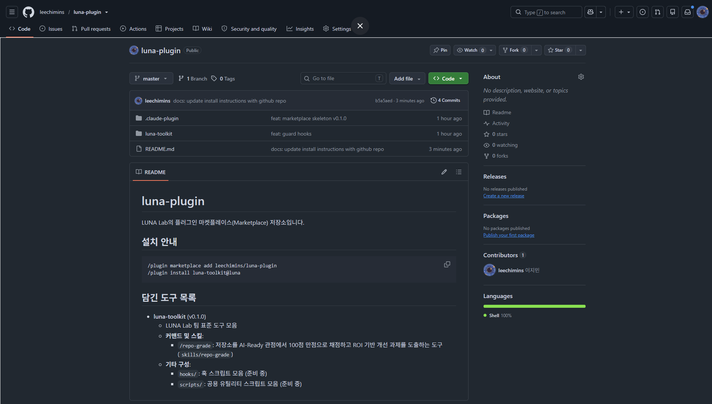

# 6주차 실습 일지

## 1. 완료한 LAB 체크리스트

- [x] LAB 01: CLAUDE.md 헌법 승격 및 재구술 검증
- [x] LAB 02: AI-Ready 채점 (repo-grade) 및 ROI 1위 개선
- [x] LAB 06: TDD 가드 훅 설치 및 강제 한 사이클
- [x] LAB 10: Agent Guardrails (Bash Prevent 가드 및 BLOCKED)
- [x] LAB 05: Team Plugin (luna-toolkit) 포장 및 타 폴더 검증
- [ ] luna-plugin GitHub 공개 저장소 배포

---

## 2. LAB별 실습 기록

### LAB 01: CLAUDE.md 헌법 승격 및 재구술 검증

- **산출물**: `CLAUDE.md`
- **커밋 해시**: `1dc4554`
- **핵심 증거**:  


- **관찰 한 줄**: AI한테 내 CLAUDE.md를 그대로 다시 읽어보라고 시켜보니, 내가 대충 쓰고 넘어갔던 문장도 AI는 곧이곧대로 규칙으로 받아들이고 있었다. 애매하게 썼던 부분이 어디였는지 그제야 눈에 들어왔다.

---

### LAB 02: AI-Ready 채점 (repo-grade) 및 ROI 1위 개선

- **산출물**: `.claude/skills/repo-grade/SKILL.md`
- **핵심 증거**:
  
  | 카테고리 | 개선 전 점수 | 개선 후 점수 | 변동 | 근거 요약 |
  | :--- | :---: | :---: | :---: | :--- |
  | **(A) 길 안내** | 10점 | 10점 | - | 구조 설명 존재, 진입점 세부 안내는 추후 보강 대상 |
  | **(B) 규칙 문서 품질** | 20점 | 20점 | - | 수정 후 총 28줄로 35줄 이내 유지 및 핵심 규칙 유지 |
  | **(C) 숨은 규칙 문서화** | **0점** | **20점** | **+20점** | `CLAUDE.md`에 Why(원칙 도입 배경) 및 Gotcha(CLI/Worktree 환경 주의사항) 명확히 문서화 |
  | **(D) 검증 게이트** | 10점 | 10점 | - | 테스트 러너 정상 동작 유지 |
  | **(E) 신선도** | 20점 | 20점 | - | 추가된 Gotcha 및 경로 정보가 실제 환경과 일치 |
  | **총점** | **60점** | **80점** | **+20점** | **80 / 100점 달성** |

    
  
- **개선 내역 및 획득 점수**: `docs: ROI improvement #1 (+20점)` — `CLAUDE.md`에 Gotchas & Why 섹션(Test-First 도입 이유, Windows CLI 주의사항, Worktree 구조)을 보강하여 숨은 규칙 문서화 항목을 0점에서 20점으로 향상 (총점 60점 ➔ 80점, +20점 획득)
- **관찰 한 줄**: 점수로 찍어보니 어디부터 손대야 할지가 감이 아니라 숫자로 보였다. 숨은 규칙 문서화 항목이 0점이라는 게 바로 눈에 띄어서 거기부터 고쳤더니 총점이 그대로 20점 올랐다.

---

### LAB 06: TDD 가드 훅 설치 및 강제 한 사이클

- **산출물**: `scripts/hooks/tdd-guard.sh`, `tests/coupon.test.js`, `src/payments/coupon.js`
- **핵심 증거**:
  - **TDD GUARD 차단 메시지 전문**:
    ```json
    {"hookSpecificOutput":{"hookEventName":"PreToolUse","permissionDecision":"deny","permissionDecisionReason":"TDD GUARD: coupon 테스트가 없습니다. 테스트를 먼저 작성하세요 (예: tests/coupon.test.js)"}}
    ```
  - **RED 실행 로그 (실패)**:
    ```text
    Error: Cannot find module '../src/payments/coupon'
    Require stack:
    - D:\orca\School_VibeCoding\Week06_WorkTree\week06\tests\coupon.test.js

    Node.js v24.21.0
    ✖ tests\coupon.test.js (93.1631ms)
    ℹ tests 1
    ℹ pass 0
    ℹ fail 1
    ```
  - **GREEN 실행 로그 (통과)**:
    ```text
    ▶ applyCoupon
      ✔ 정상 할인 (10000원, 0.1(10%) -> 9000원) (0.9084ms)
      ✔ rate가 0 이하이면 에러 (0.6738ms)
      ✔ rate가 1 초과(100%)이면 에러 (0.1722ms)
    ✔ applyCoupon (3.1845ms)
    ℹ tests 3
    ℹ suites 1
    ℹ pass 3
    ℹ fail 0
    ```
  
    
  

- **관찰 한 줄**: CLAUDE.md에 "테스트 먼저 쓰라"고 적어놨을 때는 슬쩍 넘어가던 게, 훅으로 아예 막아버리니 AI가 군말 없이 테스트부터 짜기 시작했다. 말로 하는 부탁이랑 물리적으로 막는 건 확실히 다르다.

---

### LAB 10: Agent Guardrails (Bash Prevent 가드 및 BLOCKED)

- **산출물**: `.claude/settings.json` (PreToolUse Bash 방어 훅)
- **핵심 증거**:
  - **rm -rf 실행 차단 메시지 (BLOCKED)**:
    ```text
    BLOCKED: 위험한 명령어가 감지되었습니다
    ```

  
- **관찰 한 줄**: rm -rf 같은 걸 실제로 날려보기 전에 훅이 먼저 막아서니 안심이 됐다. AI가 알아서 조심하길 기대하기보다, 애초에 위험한 명령이 실행조차 안 되게 막아두는 게 훨씬 마음 편하다는 걸 느꼈다.

---

### LAB 05: Team Plugin (luna-toolkit) 포장 및 타 폴더 검증

- **산출물**: `../luna-plugin` (marketplace.json, luna-toolkit 패키지)
- **핵심 증거**: `/help` 커맨드 등록 확인 및 타 폴더(plugin-test)에서의 `/repo-grade` 채점 실행 결과

  
  
- **관찰 한 줄**: 내 노트북 한 폴더에만 있던 스킬을 다른 폴더에서 써보려면 매번 복사해야 했는데, 플러그인으로 묶어두니 명령어 두 줄이면 그대로 설치가 됐다. 이 정도면 팀원한테 그냥 링크만 던져줘도 되겠다 싶었다.

---

### luna-plugin GitHub 공개 저장소 배포

- **저장소 링크**: 
- **핵심 증거**:

- **관찰 한 줄**:

---

## 3. 종합 관찰 (3줄 요약)

1. 규칙을 CLAUDE.md에 적어만 놓았을 때는 AI가 상황 봐가며 지키기도 하고 슬쩍 넘어가기도 했는데, PreToolUse 훅으로 deny를 걸어두니 애초에 위험한 명령 자체가 실행되지 않았다. 문서는 "부탁"이고 훅은 "차단"이라는 차이를 몸으로 확인했다.
2. repo-grade로 점수를 매기고 나니 막연히 "문서가 좀 부족한 것 같다"는 느낌이 아니라 어느 항목이 몇 점인지 숫자로 드러났다. 그 중 가장 낮았던 숨은 규칙 문서화(0점)부터 고치자 총점이 60점에서 80점으로 바로 올라갔고, 감이 아니라 숫자를 보고 개선 순서를 정하는 습관이 생겼다.
3. 매번 새 폴더에서 스킬과 훅을 다시 옮겨 심던 걸 luna-toolkit 하나로 패키징해두니, 다른 폴더에서도 명령어 두 줄이면 끝났다. 팀원이 늘어나도 온보딩 부담이 거의 없겠다는 게 확실히 체감됐다.

---

## 4. 제출 링크

- 작업 저장소(week06): 
- 플러그인 저장소(luna-plugin):

